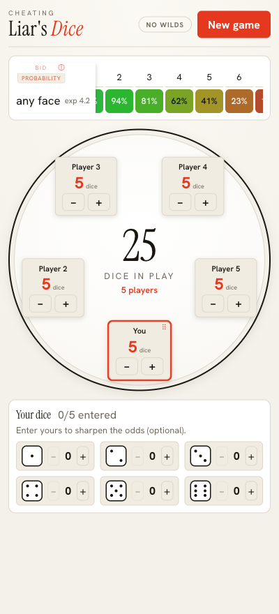
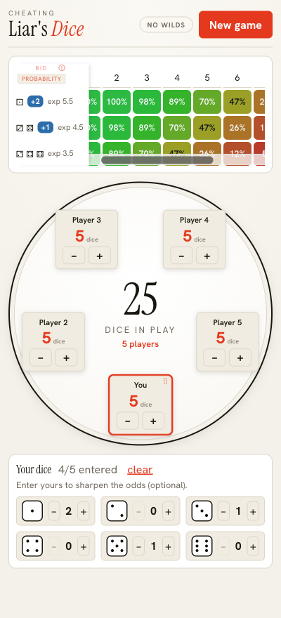

# Cheating Liar's Dice

**Liar's Dice** is a bluffing game: everyone rolls dice under a cup, then players take turns *bidding*
on how many of a face are showing across **all** the dice on the table ("at least four 5s") — each
bid higher than the last — until someone doubts it and *challenges* instead of bidding. The dice come
up; whoever was wrong loses one, and the last player with dice left wins. (Usually 1s are wild,
counting as any face.)

Every call comes down to one question: **how likely is the current bid actually true?** There's a
ladder of ways to answer it:

- **Basic — the expected count.** With `T` dice on the table, about `T / 6` of them show any given
  face (≈4 in a 25‑dice game). A bid near or below that is plausible; well above it, someone is
  probably bluffing.
- **Better — condition on your own dice.** You can see your own hand, so the matching dice in your cup
  are a guaranteed floor and only the other `T − (your dice)` are unknown — you expect about
  `(your matches) + (unknown) / 6`.
- **This app — the exact probability.** Instead of stopping at the expected count, it computes the real chance
  a bid is true from the underlying **binomial distribution**: each unknown die independently matches
  the face with probability `1/6` (or `2/6` when 1s are wild), so the number of matches is binomial and
  "at least *q*" is its upper tail. You read it straight off the colour‑coded matrix — *at least four
  5s → 62%*.

The probability is the start, not the whole story — combine it with what you know about who you're
playing (who bluffs, who only bids what they hold) to decide whether to raise or call.

### ▶ [**Open the app →**](https://brshallo.github.io/liars-dice-helper/)
Runs in any phone or desktop browser (no install needed). Add it to your home screen to use it like an app.

<p align="center">
  
  &nbsp;&nbsp;
  
</p>
<p align="center"><sub>The round table + live probability matrix · and the same matrix sharpened once you enter your own dice (blue <b>+N</b> = dice you hold).</sub></p>

> **Status:** Built and working — the probability engine (no-wilds **and** 1s-wild), the 2–10 player
> table, and the colour-coded probability matrix, installable as a PWA. Dice are entered by hand;
> photo-capture of your own dice was attempted on a side branch but **didn't pan out** —
> see [Photo capture](#photo-capture-experiment).

## Features
- **2–10 players, 1–10 dice each.** New game opens a dialog (players / dice / variant).
- **Two variants, toggleable mid-game.** Tap the header badge to flip **No wilds ⇄ 1s wild**; all
  probabilities recompute. (1s-wild: 1s count as any face.)
- **Poker-style table.** Players sit around a round table that scales from 2 to 10 without clipping.
  Drag your own seat to match where you sit; double-click a name to rename; +/- adjusts each
  player's dice; a player at 0 dice drops to a faded "OUT" chip.
- **Your dice (optional).** Enter what you're holding to turn your dice into a guaranteed floor and
  sharpen every probability.
- **Probability matrix.** Faces (grouped when they share odds) × bid quantities, coloured red→green.
  The quantity columns **auto-window** to the decision zone and start centred on the expected count;
  the face/exp column stays frozen while the numbers scroll.
- **Tap a cell → inspector.** Opens a focused readout for that exact bid plus the safest alternative
  bids. An **(i)** button explains how to read it all.
- Installable PWA (offline, add-to-home-screen).

## How to run
```
npm install
npm run dev      # dev server (prints a localhost URL)
npm test         # engine + state unit tests (vitest)
npm run build    # production build (static PWA files in dist/)
npm run preview  # serve the production build locally
```
Open `/phone.html` in the dev server to preview the app inside a phone frame at common device sizes.

## Architecture
Vite + React + TypeScript, **client-side only** — the probability math is pure functions, so the
app is just static files. The engine is built and unit-tested before any UI.

```
src/
  lib/                 # pure, variant-aware probability engine (no React) — unit-tested
    binomial.ts        # exact binomial pmf/cdf/atLeast
    probability.ts     # matchProb, effectiveFloor, probabilityOfBid, expectedCount, nextBids
    grouping.ts        # collapse faces into groups that share a distribution
    window.ts          # auto-window: the band of bid quantities worth showing
  state/               # reducer (players, dice, held dice, bid, variant) + derivePanel() selector
  ui/                  # probability colour scale, formatting helpers, editorial theme tokens
  components/
    PlayerTable/       # round table: drag-your-seat, rename, +/- dice, elimination
    Controls/          # NewGameButton (dialog) + YourDice entry
    ProbabilityPanel/  # the matrix + the (i) info and bid-inspector modals
    displays/          # MatrixView (heatmap) + InspectorView (focused single bid)
    Modal/             # reusable dialog
public/phone.html      # device-frame preview for testing the mobile layout
```

### Core math
`U` = unknown dice = total dice − the dice you hold. For a bid "at least *q* of face *f*":

```
P(≥ q of f) = 1 − BinomialCDF(q − floor − 1 ; U , matchProb)
```
- **No wilds:** `matchProb = 1/6`; `floor` = how many of *f* you hold.
- **1s wild:** a non-1 face is matched by showing *f* OR a 1, so `matchProb = 2/6`, and your held 1s
  add to the `floor` of every non-1 face. A bid *on* 1s stays `1/6`. (So even before you enter any
  dice, 1s-wild shows two rows: the 1s, and everything else.)

Faces that share the same `(floor, matchProb)` collapse into one matrix row.

## Photo capture (experiment — didn't pan out)
The original stretch goal — read your dice from a photo so the conditional probabilities fill in
automatically — was prototyped on the **`dice-capture` branch** (never merged, never wired into the
app). It tried classic computer vision (pip-counting, OpenCV) and a two-stage CNN with live
multi-frame fusion. On-device testing with real dice, **none of the approaches were good enough**, so
it's parked — manual dice entry is the shipped path. Write-up: `src/capture/README.md` on that branch.

